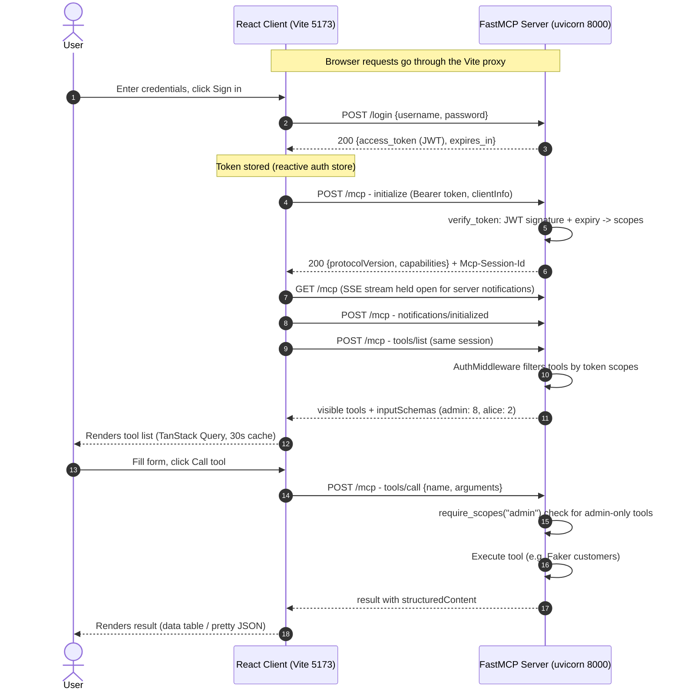

# FastMCP Test

A minimal MCP (Model Context Protocol) app:

- **Server** — Python, built with [FastMCP](https://github.com/PrefectHQ/fastmcp), served over
  Streamable HTTP with bearer-token auth. Two public tools (`add`, `reverse_string`) and six
  admin-only tools (`get_time`, `secret_message`, `get_customers`, `chart_image`, `generate_report`,
  `process_customers`).
  `generate_report` uses **user elicitation** (`ctx.elicit`) — it pauses until the human picks a
  report format, then resumes. Only the **CSV** option actually generates a report (real customer
  data as `text/csv`); pdf/png return a "not implemented" notice.
- **Client** — React + Vite + TypeScript app using **Chakra UI** and **TanStack Query**, talking
  to the server with the official `@modelcontextprotocol/sdk`. Tools and **resources** are
  browsable in tabs; results render as tables, JSON, or image/audio blocks.

## Data flow



## How auth works

1. `POST /login` with `{username, password}` returns an HS256 JWT (signed with `MCP_SECRET_KEY`)
   carrying the user's scopes.
2. Every MCP request to `/mcp` must include `Authorization: Bearer <token>`.
3. FastMCP's auth middleware enforces per-tool checks:
   - `tools/list` is **filtered server-side** — admin tools are hidden from non-admin users.
   - `tools/call` on a restricted tool is denied for users without the `admin` scope.

Demo users (from `MCP_USERS`):

| User  | Password | Scopes | Sees                              |
|-------|----------|--------|-----------------------------------|
| admin | secret   | admin  | all 8 tools                       |
| alice | wonder   | user   | public tools only                 |

## Run it

Both servers are stopped by default now — start them with the scripts in the project root:

```bash
# Start everything (MCP server :8000 + client :5173); Ctrl-C stops both
./start.sh

# …or individually
./start-server.sh   # FastMCP server (uvicorn on :8000)
./start-client.sh   # React client (Vite on :5173)
```

Credentials/secrets come from `.env` (copy `.env.example` and customize), with
sane defaults baked in. Override on the fly with env vars:
`MCP_HOST`, `MCP_PORT`, `MCP_USERS`, `MCP_SECRET_KEY`.

### 1. Server (port 8000)

```bash
cd fastmcp-test
MCP_SECRET_KEY=dev-secret MCP_USERS='admin:secret:admin,alice:wonder:user' \
  .venv/bin/python -m uvicorn main:app --port 8000
```

Or with env from a file (`.env.example`):

```bash
set -a && source .env.example && set +a
.venv/bin/python -m uvicorn main:app --port 8000
```

### 2. Client (port 5173)

```bash
cd client
npm install
npm run dev
```

Open http://localhost:5173, sign in as `admin`/`secret` (all tools) or `alice`/`wonder`
(public tools only), select a tool, fill the form, and call it.

**Dark mode**: use the sun/moon toggle in the header at any time. The choice is
persisted; until you pick explicitly, the app follows your OS preference
(`prefers-color-scheme`). Implementation: Chakra v3 semantic tokens flip with a
`dark` class on `<html>` (see `src/theme/colorMode.ts`).

The Vite dev server proxies `/login` and `/mcp` to `localhost:8000`, so no CORS setup is needed.

### Tests

```bash
# Server (FastMCP, stdio client)
pytest

# Client (Vitest + jsdom + Testing Library)
cd client && npm test
```

The server tests exercise the tools over the MCP stdio protocol; the client
tests guard the auth -> tools UI switch and the schema-driven form. (Client
auth state is reactive via a small `useSyncExternalStore` store, not query
invalidation.)

## Verify with curl

```bash
# bad credentials -> 401
curl -X POST localhost:8000/login -H 'Content-Type: application/json' \
  -d '{"username":"admin","password":"nope"}'

# good credentials -> {access_token, ...}
curl -X POST localhost:8000/login -H 'Content-Type: application/json' \
  -d '{"username":"admin","password":"secret"}'

# /mcp without a token -> 401
curl -N localhost:8000/mcp
```

## Project layout

```
main.py              FastMCP server: tools + Streamable HTTP app
                     (add, reverse_string public; get_time, secret_message,
                     get_customers, chart_image, generate_report,
                     process_customers admin-only; generate_report uses
                     ctx.elicit user elicitation, process_customers uses
                     ctx.report_progress notifications)
                     resources: customers://latest (JSON), report://revenue-chart
                     (PNG blob), customers://{id} template — all admin-only
auth.py              SimpleTokenVerifier, POST /login, JWT mint/verify
.env.example         MCP_USERS / MCP_SECRET_KEY
test_server.py       pytest suite (stdio client)
client/              React app (Chakra UI + TanStack Query + MCP TS SDK)
  src/mcp/auth.ts    login/logout + token storage
  src/mcp/client.ts  MCP client singleton + bearer-token transport
                     (listTools/callTool/listResources/readResource + elicitation
                     handler with capability { elicitation: { form: {} } })
  src/mcp/elicitation.ts  bridge between SDK elicitation requests and the dialog
  src/hooks/         TanStack Query hooks (tools, resources, auth)
  src/components/    LoginPanel, ConnectionStatus, ToolsList, ToolCard, ResultView,
                     DataTable, ResourcesPanel, ResourceViewer, ResourceContents,
                     ElicitationDialog, ColorModeToggle
PLAN.md              Design notes and future work
```

## Notes

- The MCP endpoint requires a valid token to connect (FastMCP's `RequireAuthMiddleware`), so
  clients always sign in first; per-tool scope checks then decide which tools are visible/callable.
- Auth is skipped over STDIO transport, so the server can still be added to Claude Desktop etc.
- Token expiry: 1 hour; the client reconnects with a fresh token after re-login.
